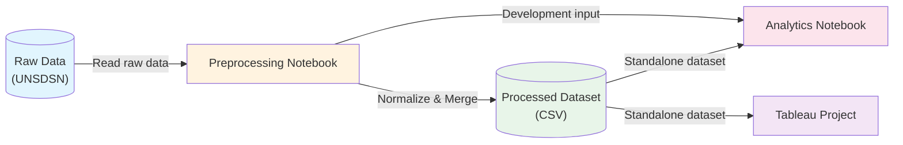

# Data Pipeline Diagram

  
  

  
  
## Pipeline Steps

1. **Raw Data Ingestion**: Read raw data published by (NAME)
2. **Data Preprocessing**: Normalize and merge data in Kaggle notebook
3. **Processed Dataset**: Output single CSV file, published as standalone Kaggle dataset
4. **Downstream Consumption**:
   - Analytics notebook (development used upstream notebook directly)
   - Tableau project (uses published standalone dataset)

## Links

| Component | Link |
|-----------|------|
| Raw Data | (LINK) |
| Preprocessing Notebook | (LINK) |
| Processed Dataset | (LINK) |
